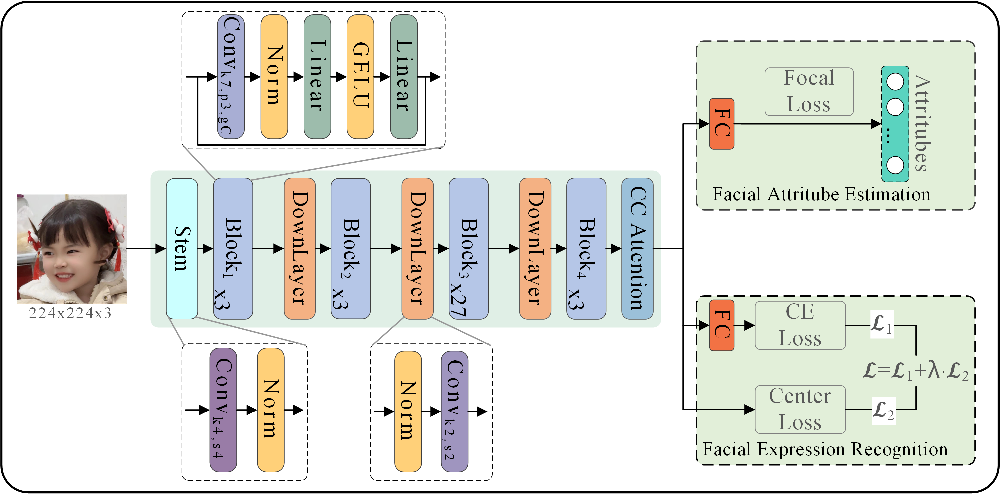
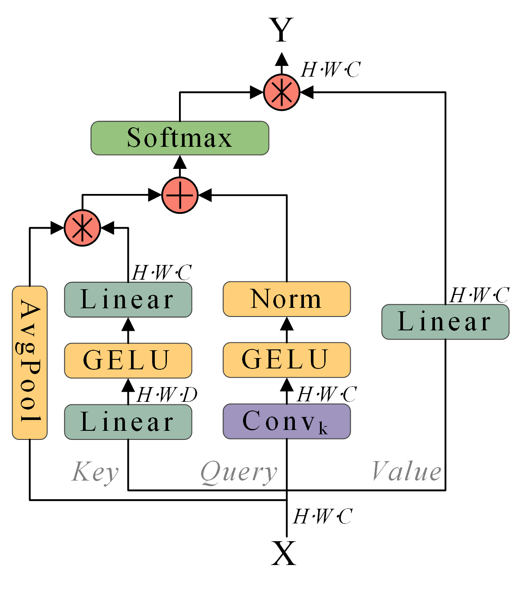
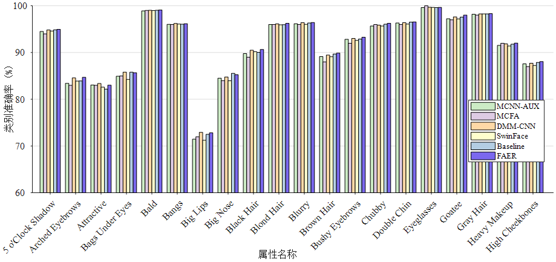
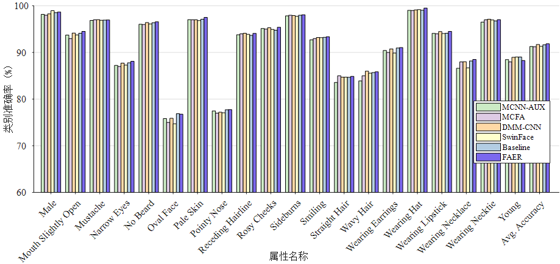

# 基于上下文通道注意力机制的人脸属性估计与表情识别

# Facial attribute estimation and expression recognition based on contextual channel attention mechanism

<div align=center>
Grad-CAM for MFER on RAF-DB dataset
</div>
<div align=center>


Fig. 1 Architecture of proposed FAER
</div>

A PyTorch implementation of the [FAER](https://kns.cnki.net/kcms2/article/abstract?v=v5HVlYuqh9qy9Jy50ovh3R_ohTNoNi1Tw2-GgzoZ7z8DdzkZ__gFP4MYpB-sBX-4B9uMnQMOMuFXbwyWaNdzjHNFlDiD6hReqGS5Upt4YNMx6bycOGrmzffSsQ4lXtT_3Nr8wZ-iNNs=&uniplatform=NZKPT&flag=copy).

## 1、Proposed Contextual Channel Attention mechanism

<div align=center>


Fig. 2 Architecture of Contextual Channel Attention
</div>

## 2、Preparation

- Download pre-trained model of MS-Celeb-1M (we will add the URL soon~~~).
- Download [CelebA](https://mmlab.ie.cuhk.edu.hk/projects/CelebA.html) dataset and extract to `./dataset` dir.
- Download [RAF-DB](http://www.whdeng.cn/raf/model1.html) dataset and extract to `./dataset` dir.
- Download [AffectNet](http://mohammadmahoor.com/affectnet/) dadtaset and extract the to `./dataset` dir.

## 3、Note

The code for FaceExpression and FaceAttribute are similar, except for the Loss Function and the Type of label the model predicts.

```
And the remain file or code will release soon!!!!!!
```

## 4、Training

We provide the training code for CelebA, AffectNet and RAF-DB.  

For AffectNet、RAF-DB dataset, run:

```
Comming soon
```

For CelebA dataset, run:

```
CUDA_VISIBLE_DEVICES=0,1 python main_celeba.py 
```

## 5、Models

Pre-trained models can be downloaded for evaluation as following:

|     task    | accuracy     | link         |
|:-----------:|:------------:|:------------: |
| `CelebA`    | `91.87%`     |`Comming soon` |
| `AffectNet` | `66.66%`     |`Comming soon` |  
| `RAF-DB`    | `91.75%`     |`Comming soon` |

## 6、Class-wise accuracy and avg. accuracy of CelebA

<div align=center>


Fig. 4(a) Class-wise accuracy of FAER on CelebA[0:20]
</div>

<div align=center>


Fig. 4(b) Class-wise accuracy of FAER on CelebA[21:41]
</div>

## License

Our research code is released under the MIT license. See [LICENSE](./LICENSE) for details.

## Reference

you may want to cite:

```
@ARTICLE{徐杰2024基于上下文通道注意力机制的人脸属性估计与表情识别,
  title={基于上下文通道注意力机制的人脸属性估计与表情识别},
  author={徐杰 and 钟勇 and 王阳 and 张昌福 and 杨观赐},
  journal={计算机应用},
  pages={0},
  year={2024},
  doi={10.11772/j.issn.1001-9081.2024010098}}

@ARTICLE{Xu Jie 2024 Facial attribute estimation and expression recognition based on contextual channel attention mechanism,
  title={Facial attribute estimation and expression recognition based on contextual channel attention mechanism},
  author={Xu, Jie and Zhong, Yong and Wang, Yang and Zhang, Changfu and Yang, Guanci},
  journal={Journal of Computer Applications},
  pages={0},
  year={2024},
  doi={10.11772/j.issn.1001-9081.2024010098}}
```

## For more detail imformation, see

[基于上下文通道注意力机制的人脸属性估计与表情识别](./set/基于上下文通道注意力机制的人脸属性估计与表情识别_徐杰.pdf)
